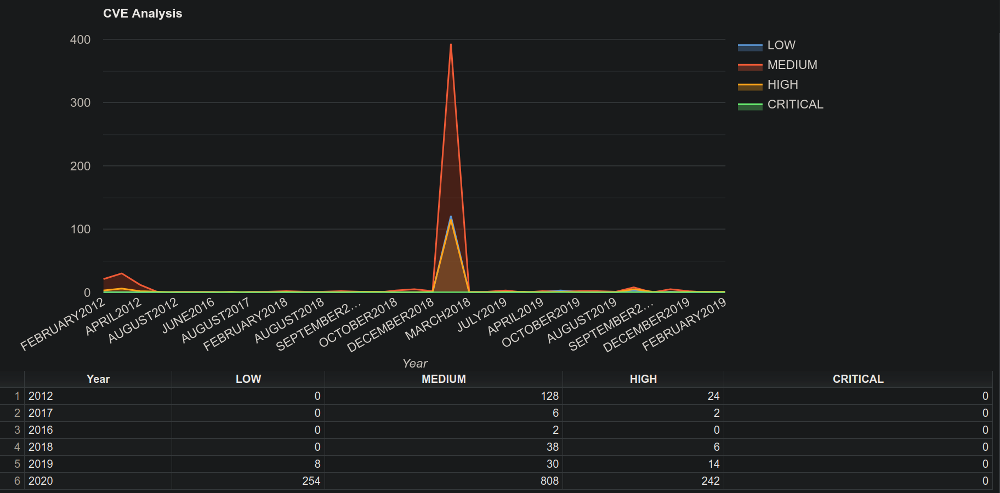

# CVE_Data_Analysis
#### Candidate: MATT(EO) DI GREGORIO
#### Position: Junior Java Developer
#### matteodgrgr@gmail.com

### About this project

As requested I have implemented the CVE data analysis task. The project is in Java and I'm using SpringBoot with an
embedded Tomcat server listening on default port: **8080**. I'm using Thymeleaf for the view in combination with Google charts.

The project contains the following packages:
- **controller** - containing the application controller exposing the endpoint: **/api/v1/chart**.
- **repository** - for reading and storing data from JSON file.
- **model** - for mapping JSON to POJOS.
- **service** - service classes communicating with the repository.
- **utils** - utility classes for filtering the data.

### How To Use

Run the application on port 8080 or your chosen port (by overriding the value in the properties file). Once the application 
is up and running head over to your browser and send a request to **http://localhost:8080/api/v1/chart**.

You should now be able to see the following:

**Run With Docker**

If you prefer to run the application with Docker head over to the **docker** folder and from within the terminal run:
**docker build . -t <your-preferred-tag>** and then **docker run --name <container-name> -p 8080:8080 -d <your-image-tag>**
Once the container is up and running head over to your browser and send a request to **http://localhost:8080/api/v1/chart**.
